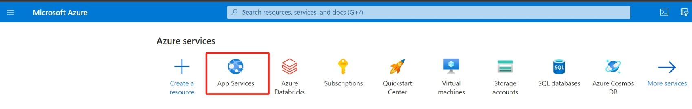
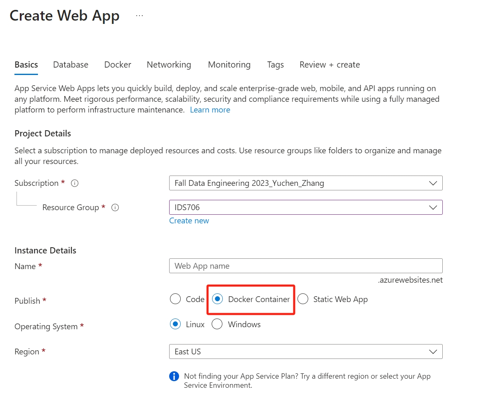
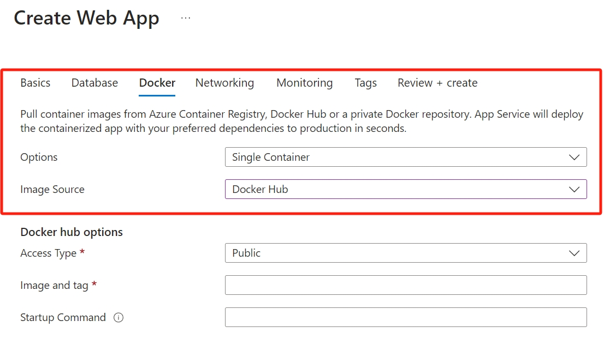
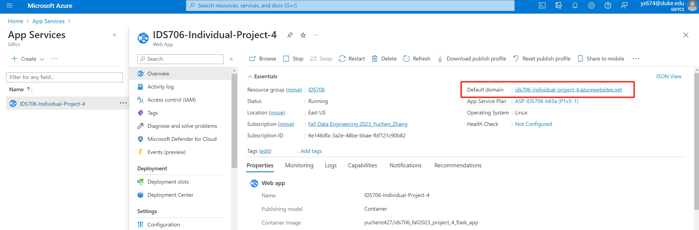
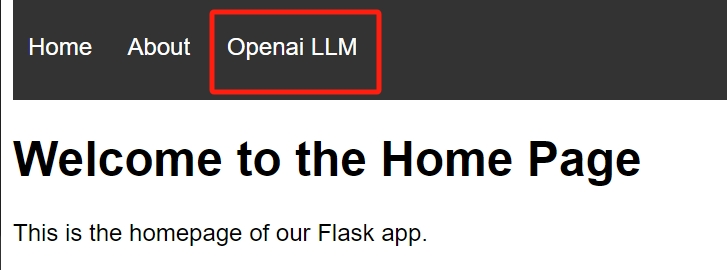
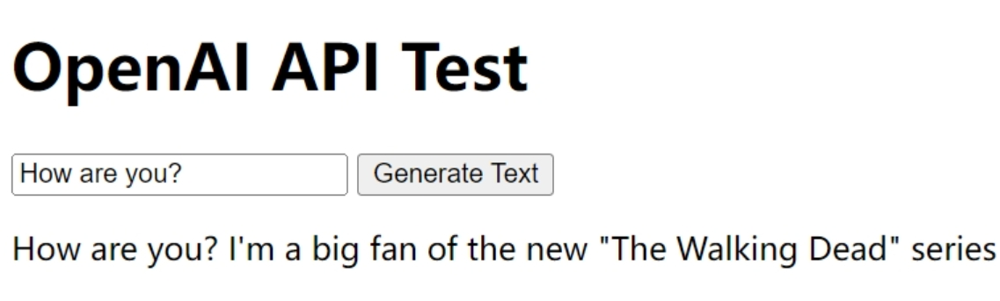

[](https://github.com/nogibjj/IDS706_Fall2023_Project_4_Flask_App/actions/workflows/install.yml)
[](https://github.com/nogibjj/IDS706_Fall2023_Project_4_Flask_App/actions/workflows/lint.yml)
[](https://github.com/nogibjj/IDS706_Fall2023_Project_4_Flask_App/actions/workflows/format.yml)
[](https://github.com/nogibjj/IDS706_Fall2023_Project_4_Flask_App/actions/workflows/test.yml)
# IDS706 Fall 2023 Project 4 Auto Scaling Flask App Using Serverless Platform

Fall 2023 IDS_706 Data Engineering Systems Individual Project 4: Publicly accessible auto-scaling container using Azure App Services and Flask.

It contains:

- ``app.py`` a ``Flask`` app that can be deployed on Azure App, which integrates functionality of ``LLM``

- ``Dockerfile`` that defines the process of building the ``Docker`` container

- ``.devcontainer`` includes a `Dockerfile` that specifies the configurations of container, and a `devcontainer.json` which is a configuration file used in the context of Visual Studio Code

- ``workflows`` includes `GitHub Actions`, enables automated build, test and deployment for the project

- ``Makefile`` specifies build automation on Linux

- ``requirements.txt`` lists the dependencies, libraries, and specific versions of Python packages required for the project

It also includes ``main.py`` and ``test_main.py`` as sample files to show the functionality of the CI pipeline.

## How to deploy the Flask App to Azure App Service
### Create Azure App
First, create a new ``App`` on ``Azure``: 

<br>
Then choose ``Docker Container`` as the Publish method:

<br>
In ``Docker`` tab, choose ``Docker Hub`` as ``Image Source``:

<br>

### Create Dockerfile
``Dockerfile`` defines the building process of Docker environment. It does the following:
- Create an image that contains ``Python 3.10``
- Copy all the project files
- Install the dependencies listed in ``requirements.txt``
- Run the ``Flask`` app when the container launches
- Expose port ``5000``

### Create Docker Repository on DockerHub
Log in to ``DockerHub`` and create a repository (e.g. ``yuchenz427/ids706_fall2023_project_4_flask_app``) for the incoming ``Docker`` image.<br>
<br>
Then run the following command to build and push the image to the repository:
```bash
sudo docker login --username=yuchenz427
sudo docker build --no-cache -t yuchenz427/ids706_fall2023_project_4_flask_app .
sudo docker push yuchenz427/ids706_fall2023_project_4_flask_app
```

### Get Access to Flask App via Public Domain
The ``Flask`` app is now publicly available via the default domain provided by ``Azure App Service``.


## The embedded LLM within Flask
The ``Flask`` app included in this project is a simple website which integrates an interface to the openai ``GPT`` model. 

<br>
Users can input their prompts and get the response from the GPT model:<br>
